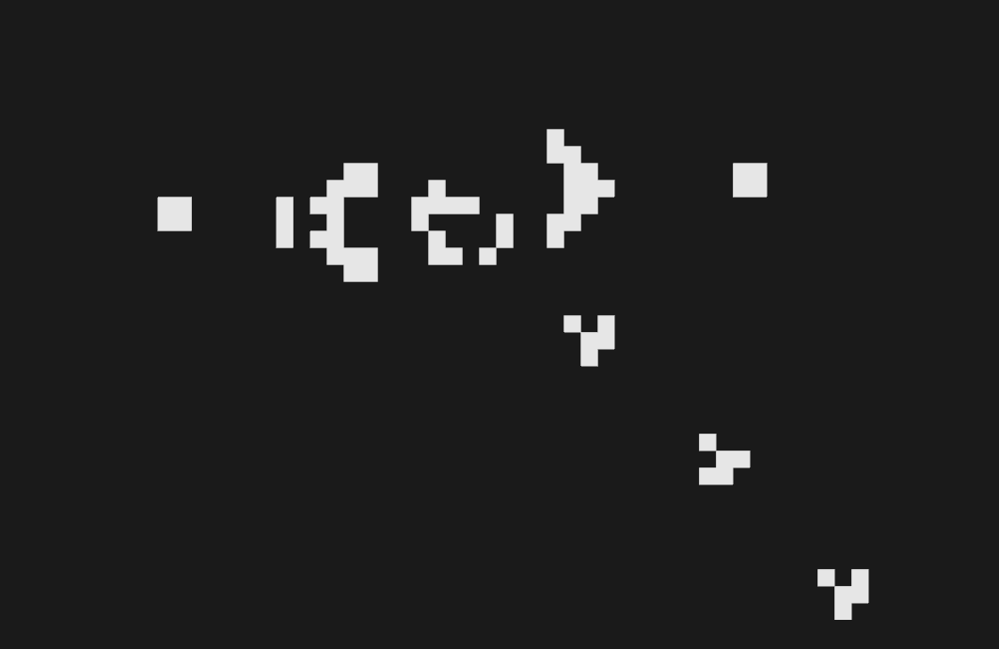

# GOL (Game of Life)

Conways game of life app implemented in Rust, using [Nannou](https://nannou.cc/).

## Features

- Saving/loading (use `--load [savestate name]` to load a game).
- Selections (copy/paste/cut/rotate/translate).
- Toggleable grid lines.
- Basic camera controls.
- Customize everything in the config.toml file (savestates are stored in the same file).
  - `~/.local/share/stuff_made_by_lily/GOL/config.toml` on Linux.
  - `C:\[USER]\Alice\AppData\Roaming\stuff_made_by_lily\GOL\config.toml` on Windows.
  - `$HOME/Library/Application Support/stuff_made_by_lily/GOL/config.toml` on MacOS.

## Screenshots

